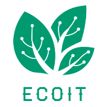

# ECF - PROJET ECOIT 
 ***

## Description

Les documents annexes sont disponibles dans le dossier ANNEXES :

* Charte graphique
* Manuel d'utilisation
* Documentation technique
* Wireframes

 ***

## Récupération du projet

```
$ git clone git@github.com:Pierrechami/Evaluation-ECF.git
```

 ***

## Installation

```
# Déplacement dans le dossier
cd Eco-web

# Installation des dépendances
composer install

# Création de la base de données
php bin/console doctrine:database:create

# Création des tables (migrations)
php bin/console doctrine:migrations:migrate

# Insertions des jeux de données (fixtures)
php bin/console doctrine:fixtures:load 
```
 ***

## Tu veux être un utilisateur

Après le chargement des fixtures, tu peux utiliser ces identifiants pour : 

* Un dministrateur 
```
Email =  chaminadepierre.24@gmail.com
Mdp = superAdmin
```
* Un instructeur non validé
```
Email =  instructeurnonvalide@gmail.com
Mdp = Instructeur
```
* Un instructeur 
```
Email =  instructeur@gmail.com
Mdp = Instructeur
```
* Un apprenant
```
Email =  apprenant@gmail.com
Mdp = Apprenant
```

 ***

## Utilisation 

Deux options pour lancer le serveur de développement PHP :

* Si vous avez installé _Symfony_
```
symfony server:start
```

* Si vous utilisez _Composer_, il faut installer le Web Server Bundle :
```
composer require symfony/web-server-bundle --dev
php bin/console server:start
```


